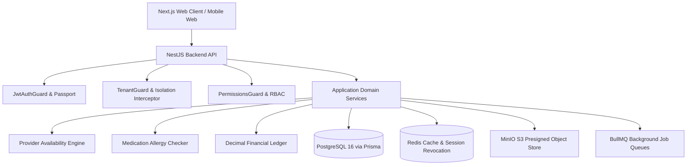
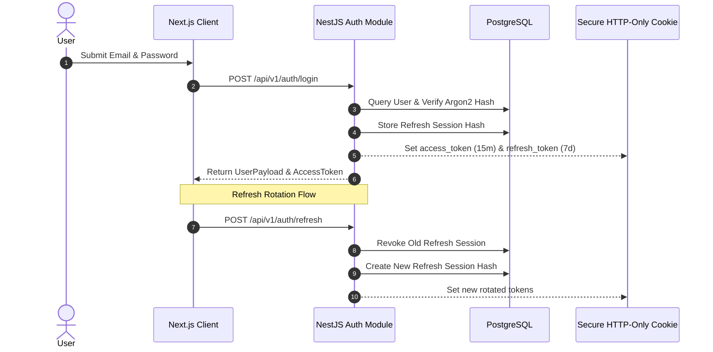
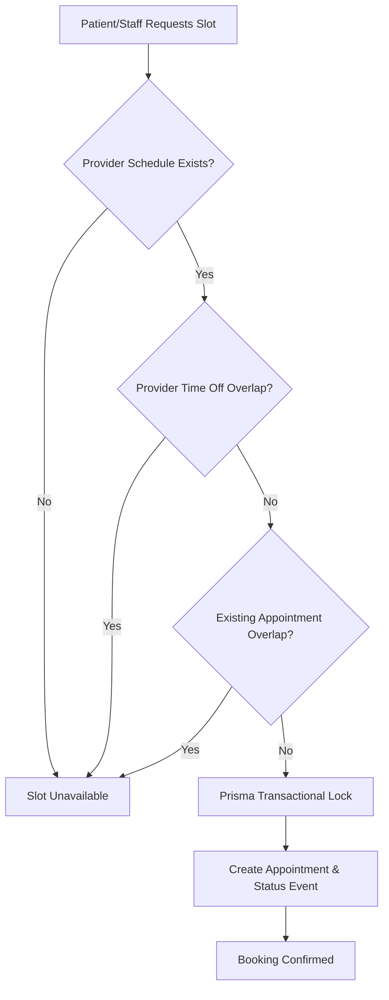

# System Architecture - HealthBridge Platform

## High-Level Monorepo Architecture

```mermaid
graph TD
    Client[Next.js Web Client / Mobile Web] --> API[NestJS Backend API]
    API --> AuthGuard[JwtAuthGuard & Passport]
    API --> TenantGuard[TenantGuard & Isolation Interceptor]
    API --> PermGuard[PermissionsGuard & RBAC]

    API --> ServiceLayer[Application Domain Services]
    ServiceLayer --> AvailabilityEngine[Provider Availability Engine]
    ServiceLayer --> AllergyChecker[Medication Allergy Checker]
    ServiceLayer --> LedgerEngine[Decimal Financial Ledger]

    ServiceLayer --> DB[(PostgreSQL 16 via Prisma)]
    ServiceLayer --> Cache[(Redis Cache & Session Revocation)]
    ServiceLayer --> Storage[MinIO S3 Presigned Object Store]
    ServiceLayer --> Queue[BullMQ Background Job Queues]
```

## Authentication & Token Rotation Sequence

```mermaid
sequenceDiagram
    autonumber
    actor User
    participant Web as Next.js Client
    participant API as NestJS Auth Module
    participant DB as PostgreSQL
    participant Cookie as Secure HTTP-Only Cookie

    User->>Web: Submit Email & Password
    Web->>API: POST /api/v1/auth/login
    API->>DB: Query User & Verify Argon2 Hash
    API->>DB: Store Refresh Session Hash
    API-->>Cookie: Set access_token (15m) & refresh_token (7d)
    API-->>Web: Return UserPayload & AccessToken

    Note over Web, API: Refresh Rotation Flow
    Web->>API: POST /api/v1/auth/refresh
    API->>DB: Revoke Old Refresh Session
    API->>DB: Create New Refresh Session Hash
    API-->>Cookie: Set new rotated tokens
```

## Appointment Scheduling & Availability Engine

```mermaid
flowchart TD
    Req[Patient/Staff Requests Slot] --> ScheduleCheck{Provider Schedule Exists?}
    ScheduleCheck -- No --> Unavailable[Slot Unavailable]
    ScheduleCheck -- Yes --> TimeOffCheck{Provider Time Off Overlap?}
    TimeOffCheck -- Yes --> Unavailable
    TimeOffCheck -- No --> BookingCheck{Existing Appointment Overlap?}
    BookingCheck -- Yes --> Unavailable
    BookingCheck -- No --> Transaction[Prisma Transactional Lock]
    Transaction --> CreateApt[Create Appointment & Status Event]
    CreateApt --> Success[Booking Confirmed]
```
