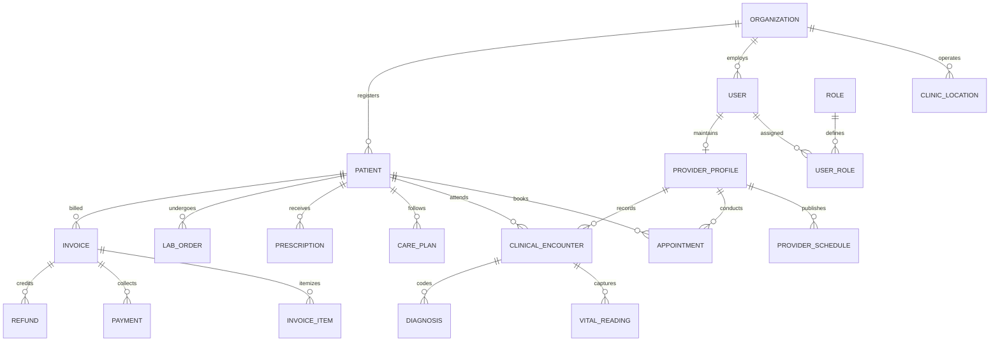

# Database Design & Prisma ERD

## Core Data Entities

The HealthBridge database contains 38+ entities organized around multi-tenant organization scoping:

- **Organization Scoping**: All primary tables (`User`, `Patient`, `Appointment`, `ClinicalEncounter`, `CarePlan`, `Prescription`, `LabOrder`, `MedicalDocument`, `Invoice`, `AuditLog`) maintain indexed `organizationId` foreign key relations.
- **Audit Trails**: Changes to sensitive clinical records and payments are tracked in `AuditLog` records.
- **Financial Precision**: Money attributes use PostgreSQL `DECIMAL(12, 2)` mapped through `Decimal.js` to ensure exact calculations without IEEE 754 floating-point inaccuracies.

## ERD Mermaid Diagram

